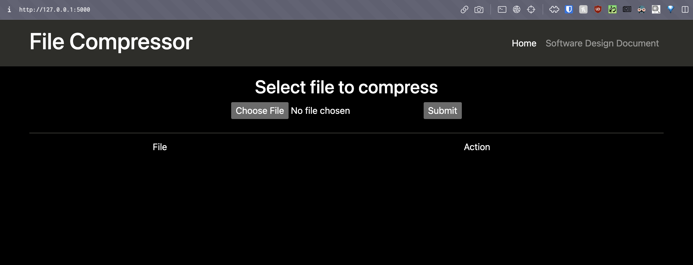

# Compressor of files
/Tue Apr 6, 2021/

## Build
```python
source env/bin/activate
pip3 install -r requirements.txt
```
##  Create db
From python3 terminal 
```python
python3 
from app import db
db.create_all()
db.session.commit()
exit()
```

## Start application
python3 app.py


